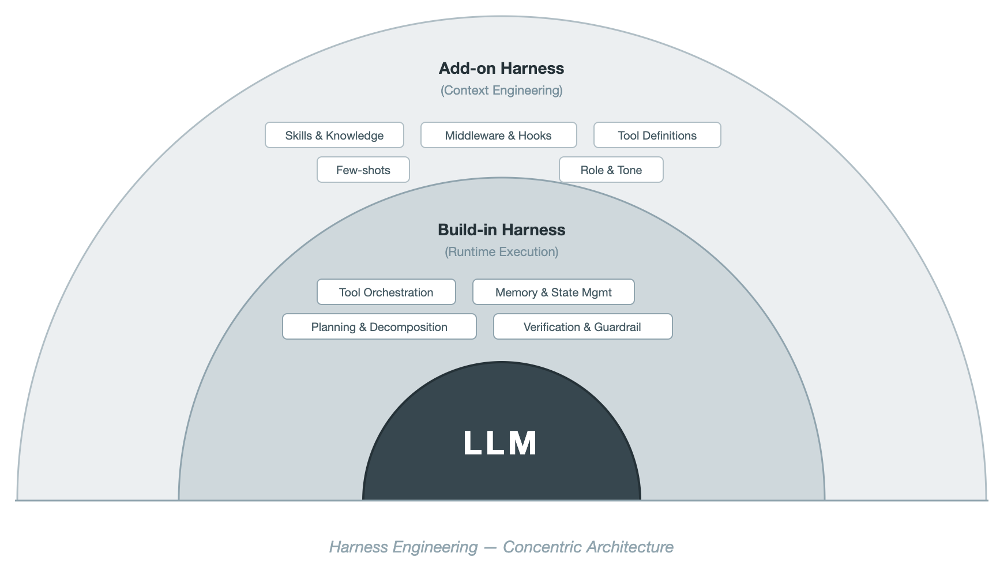

# joint_optimization_of_harness_and_model

harness engineering的开发工作可以概括为6个部分：
1. context engineering
2. tool orchestration
3. planning & decomposition
4. memory & state management
    - working context
    - session state
    - long-term memory
5. verfication & guardrails
6. lifecycle management

> - Layer 1: LLM
> - Layer 2: build-in Harness (runtime execution)：tool orchestation, memory&state management, planing&decomposition, verification&guardrail
> - Layer 3: add-on Harness (context engineering): skills&knowledge, few-shots, middleware&hooks, tool def, role&tone

